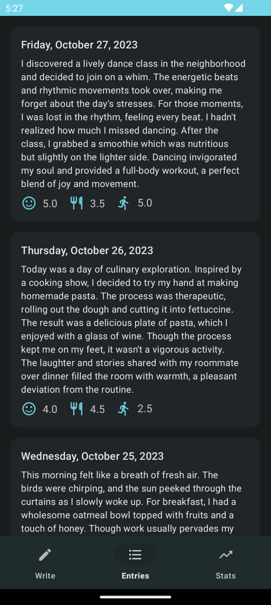

### Dayournal

## Functionality

The dayournal app is your personal diary application that allows you to record your daily experiences, activities, and emotions. With a unique rating system, you can keep track of your sentiment, nutritional intake, and physical movement each day, enabling a deeper understanding of your well-being.

You can read up on your past entries but also figure out how well you are doing regularly, as the app features a statistics page that lets you see the average of each wellness rating throughout your entries.

## Screenshots

## Obtained Points

The goal is to reach is 7 points, as I am coding this app by myself.

* Using Kotlin instead of Java (3 points)
* Functionality per Function / Screen (1 - 5 points)
* Persistence / offline capability (1 - 3 points)